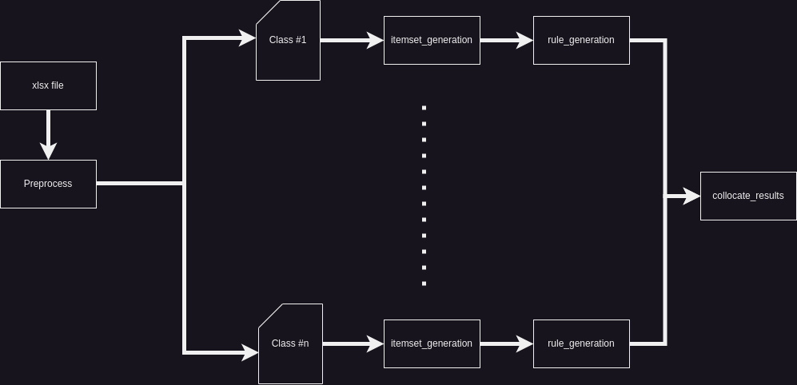

# Apriori Algorithm with Apollo

This is the implementation of Apriori algorithm for association rule mining (ARM) with Apollo orchestration platform

## Installation
Apollo tutorial is available on [YouTube](https://www.youtube.com/@apolloruntimesystem6686/featured).

The Apriori ARM has been taken from the [Efficient-Apriori](https://github.com/tommyod/Efficient-Apriori) repository.

## Implementation
An implementations of apriori ARM is available in the repository.

The following image is the implementation Block Diagram:



## Setting up the implementation for execution
### Prerequisites
Java, Docker, faas-cli, and python3 are required for the execution; Java and Docker could be installed with the following commands:
```sh
sudo apt update
sudo apt install default-jre
sudo apt install docker.io
curl -sSL https://cli.openfaas.com | sudo sh
```
Also, add the following line to `~/.bashrc`:
```sh
alias python=python3
```


Several files must be manipulated before executing each implementation. The following variations need to be made:
```
<project-dir>/deployment/apriori/configs/GARM.xml: All the paths must point to the appropriate files in the new environment
<project-dir>/deployment/apriori/demoInput/typeMappings.json: The Images id in the properties attribute must point to the dockerhub id of new environment
<project-dir>/FunctionTemplate/openfaas/push_images: The Images id in the properties attribute must point to the dockerhub
<project-dir>/FunctionTemplate/openfaas/stack.yml: The Images id in the properties attribute must point to the dockerhub
<project-dir>/FunctionTemplate/openfaas/typeMappings.json: The Images id in the properties attribute must point to the dockerhub
     id of new environment
```

### Creating and pushing the images to Docker Hub
You can build and push the function images to Docker Hub with running the build and push command by `<project-dir>/build_and_push.sh`. Use 'sudo' if docker requires.

### Execute the project
You can execute the project by `<project-dir>/main 0.5 1 8` command. The numbers represet _mininum support_, _minimum confidence_, and _maximum length_, respectively. Use 'sudo' if docker requires.

In the pop-up Apollo GUI, load the execution settings in `<project-dir>/deployment/apriori/configs/GARM.xml` path.

The results are exported to `<project-dir>/output.json` path.

The repository has been tested on a ubuntu-18 VM.
